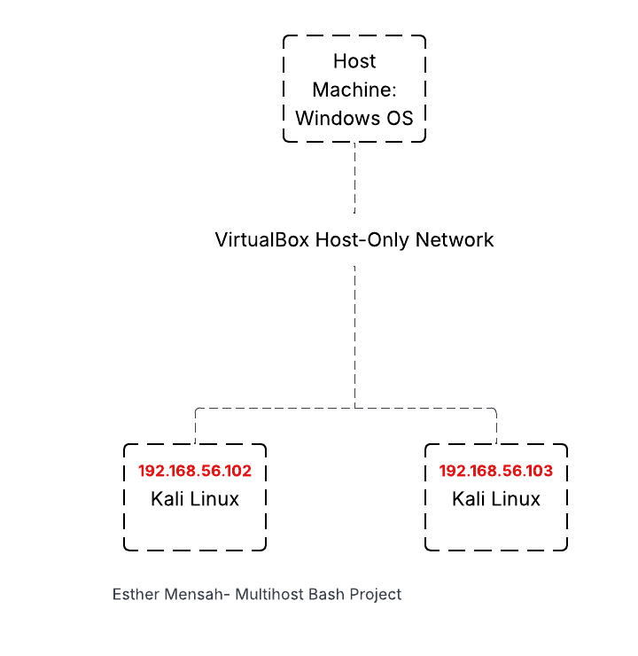
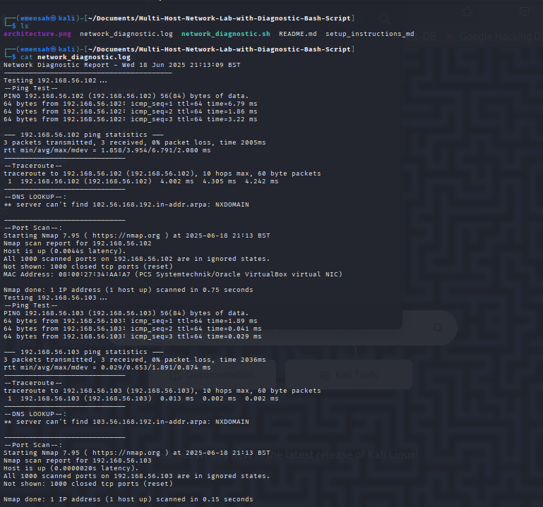

# Multi-Host Network Diagnostic Lab (Linux + Bash)

This project simulates a small network lab using VirtualBox and Linux VMs. The goal is to practice core networking concepts and automate diagnostics using a custom Bash script.

---

## Project Overview

- Built a virtual lab with **2+ Linux VMs (Kali)** using **VirtualBox Host-only networking**
- Assigned **static IPs** to each VM for consistent testing
- Wrote a Bash script to automate common network diagnostics:
  - `ping` test
  - `traceroute` for path discovery
  - `nslookup` for DNS testing
  - `nmap` for port scanning
- Logged results to a single file (`network_diagnostic.log`) for auditing and troubleshooting

---

## 🛠️ Tools & Technologies

- 🐧 Linux (Kali / Ubuntu)
- 💻 VirtualBox
- ⚙️ Bash scripting
- 📡 ping, traceroute, nslookup,nmap


---

## Architecture




---

## Results after script is run 




## Explanation of results 

**Ping**: The ping command confirms connectivity between the VMs. Both hosts (192.168.56.102 and 192.168.56.103) responded successfully with 0% packet loss, indicating stable and reachable connections. The low round-trip times (RTTs) suggest they’re on the same local virtual network with minimal latency.

**Traceroute**: Each traceroute shows a single hop to its target, which is expected in a host-only VirtualBox network. This means traffic is being routed directly between VMs without intermediate devices, confirming correct internal routing setup.

**nslookup**: DNS lookups failed for both IP addresses. This is expected because reverse DNS records (PTR) are  not configured. The errors (NXDOMAIN) indicate there’s no reverse mapping for those IPs.

**Nnmap**: Nmap results show that all 1000 common TCP ports are closed on both VMs. This implies there are no actively listening services (like SSH, HTTP, etc.) on the scanned targets. The hosts are up, but no network services are exposed


## Usage

1. **Clone this repo** in your VM:
   ```bash
   git clone https://github.com/esthermensah/Multi-Host-Network-Lab-with-Diagnostic-Bash-Script.git

   cd Multi-Host-Network-Lab-with-Diagnostic-Bash-Script
